# SingleCell AI Insights - Architecture Diagrams (Mermaid)

## Complete Architecture Diagram

## Simplified Data Flow Diagram

```mermaid
sequenceDiagram
    participant User as 👥 User
    participant CF as ☁️ CloudFront
    participant ALB as ⚖️ ALB
    participant ECS as 🐳 Django (ECS)
    participant RDS as 🗄️ PostgreSQL
    participant Bedrock as 🤖 Bedrock AI
    participant HealthOmics as 🧬 HealthOmics
    
    User->>CF: HTTPS Request
    CF->>CF: Route based on path
    
    alt Frontend Request (/)
        CF->>User: Serve React SPA from S3
    else API Request (/api/*)
        CF->>ALB: Forward to backend
        ALB->>ECS: HTTP :8000
        ECS->>RDS: Query database
        RDS-->>ECS: Return data
        ECS->>HealthOmics: Fetch workflow runs
        HealthOmics-->>ECS: Run metadata
        ECS-->>ALB: JSON response
        ALB-->>CF: Response
        CF-->>User: JSON data
    else Chat Request (/api/runs/*/chat/)
        CF->>ALB: Forward to backend
        ALB->>ECS: HTTP :8000
        ECS->>RDS: Get run data
        ECS->>Bedrock: AI inference
        Bedrock-->>ECS: AI response
        ECS->>RDS: Save conversation
        ECS-->>ALB: JSON response
        ALB-->>CF: Response
        CF-->>User: Chat message
    end
```

## Security Architecture

## Deployment Pipeline

```mermaid
graph LR
    subgraph Developer["👨‍💻 Developer"]
        Code[📝 Code Changes<br/>Backend/Frontend]
    end
    
    subgraph BuildPipeline["🔨 Build Pipeline"]
        Zip[📦 Create Source Zip]
        S3Upload[☁️ Upload to S3]
        CBTrigger[▶️ Trigger CodeBuild]
        DockerBuild[🐳 Build Docker Image]
        ECRPush[📤 Push to ECR]
    end
    
    subgraph Deployment["🚀 Deployment"]
        ECSUpdate[🔄 Update ECS Service]
        HealthCheck[✅ Health Checks]
        TaskSwap[🔀 Blue/Green Deploy<br/>min: 100%, max: 200%]
        OldTaskDrain[⏳ Drain Old Tasks]
        Complete[✅ Deployment Complete]
    end
    
    subgraph Monitoring["📊 Monitoring"]
        Logs[📋 CloudWatch Logs]
        Metrics[📈 ECS Metrics]
        BudgetAlert[💰 Budget Alerts]
    end
    
    Code --> Zip
    Zip --> S3Upload
    S3Upload --> CBTrigger
    CBTrigger --> DockerBuild
    DockerBuild --> ECRPush
    ECRPush --> ECSUpdate
    ECSUpdate --> HealthCheck
    HealthCheck --> TaskSwap
    TaskSwap --> OldTaskDrain
    OldTaskDrain --> Complete
    
    Complete --> Logs
    Complete --> Metrics
    Complete --> BudgetAlert
    
    classDef devStyle fill:#E1F5FE,stroke:#0277BD,stroke-width:2px
    classDef buildStyle fill:#FFF9C4,stroke:#F57F17,stroke-width:2px
    classDef deployStyle fill:#C8E6C9,stroke:#388E3C,stroke-width:2px
    classDef monitorStyle fill:#F3E5F5,stroke:#7B1FA2,stroke-width:2px
    
    class Developer devStyle
    class BuildPipeline buildStyle
    class Deployment deployStyle
    class Monitoring monitorStyle
```

## Cost Breakdown

## Network Flow

```mermaid
graph TB
    subgraph Internet["🌐 Internet"]
        IGW[Internet Gateway]
    end
    
    subgraph PublicSubnets["Public Subnets"]
        NAT[NAT Gateway<br/>Elastic IP]
    end
    
    subgraph PrivateSubnets["Private Subnets"]
        ECS[ECS Tasks<br/>No Public IP]
    end
    
    subgraph IsolatedSubnets["Isolated Subnets"]
        RDS[RDS Database<br/>No Internet]
    end
    
    IGW -->|Inbound| NAT
    NAT -->|Outbound Only| ECS
    ECS -->|Internal| RDS
    ECS -.->|No Direct Access| IGW
    RDS -.->|No Access| NAT
    
    classDef publicStyle fill:#E8F5E9,stroke:#388E3C,stroke-width:2px
    classDef privateStyle fill:#FFF9C4,stroke:#F57F17,stroke-width:2px
    classDef isolatedStyle fill:#FFEBEE,stroke:#C62828,stroke-width:2px
    
    class PublicSubnets publicStyle
    class PrivateSubnets privateStyle
    class IsolatedSubnets isolatedStyle
```

## How to Use These Diagrams

### In GitHub README
Just paste the mermaid code blocks - GitHub will render them automatically!

### Export as Images
1. Use [Mermaid Live Editor](https://mermaid.live/)
2. Paste the code
3. Export as PNG/SVG

### In Documentation
- GitHub/GitLab: Native support
- Notion: Use mermaid blocks
- Confluence: Use mermaid macro
- VS Code: Install Mermaid extension

### For Presentations
1. Export from Mermaid Live Editor
2. Import PNG/SVG into PowerPoint/Keynote
3. Or use reveal.js with mermaid plugin
