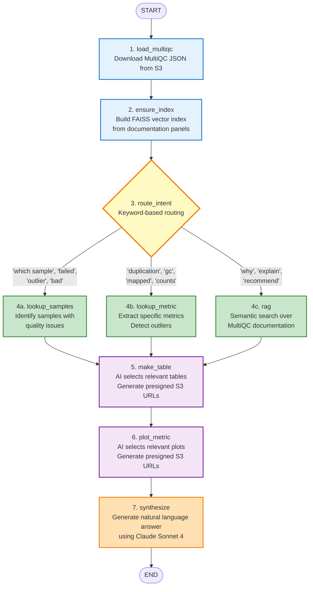

# LangGraph Agent Workflow

## 8-Node Directed Graph



## Node Descriptions

### Data Loading Nodes (Blue)
- **load_multiqc**: Downloads `multiqc_data.json` from S3 using the run's output directory
- **ensure_index**: Builds in-memory FAISS vector store from MultiQC documentation panels for semantic search

### Routing Node (Yellow)
- **route_intent**: Uses keyword pattern matching to determine which analysis strategy to use
  - Sample lookup: Questions about sample quality, failures, outliers
  - Metric lookup: Questions about specific metrics (duplication, GC content, mapping rates)
  - RAG: Questions asking for explanations, interpretations, or recommendations

### Analysis Nodes (Green)
- **lookup_samples**: Identifies samples with quality issues by checking fail flags and thresholds
- **lookup_metric**: Extracts specific metrics across samples, calculates statistics, detects outliers
- **rag**: Performs semantic search over MultiQC documentation using FAISS vector similarity

### Artifact Nodes (Purple)
- **make_table**: Uses Claude Sonnet 4 to intelligently select relevant data tables (from 7 available) based on the question, generates presigned S3 URLs
- **plot_metric**: Uses Claude Sonnet 4 to intelligently select relevant plots (from 9 available) based on the question, generates presigned S3 URLs

### Synthesis Node (Orange)
- **synthesize**: Uses Claude Sonnet 4 to generate natural language answer combining:
  - Analysis results from the chosen strategy
  - Links to relevant tables and plots
  - Conversation history for context
  - Recommendations and next steps

## State Flow

All nodes share a common state dictionary that accumulates information:

```python
{
    'run_id': str,              # HealthOmics run ID
    'question': str,            # User's question
    'conversation_history': [], # Previous messages
    'multiqc_data': dict,       # Loaded MultiQC JSON
    'panels': [Document],       # Documentation for vector search
    'vs': FAISS,                # Vector store instance
    'samples': [str],           # Sample names (from lookup_samples)
    'metric_key': str,          # Metric identifier (from lookup_metric)
    'metric_data': dict,        # Metric values (from lookup_metric)
    'rag_context': str,         # Retrieved documentation (from rag)
    'table_urls': [dict],       # List of selected tables with presigned URLs
    'plot_urls': [dict],        # List of selected plots with presigned URLs
    'answer': str,              # Final synthesized answer
    'citations': [],            # Source citations
    'notes': []                 # Additional metadata
}
```

## Why This Architecture?

**Traditional RAG is stateless** - It retrieves documents and generates an answer in one shot.

**Quality analysis needs multi-step reasoning:**
1. Load and understand the data structure
2. Decide what type of analysis is needed
3. Perform specialized calculations (outlier detection, statistics)
4. Find relevant visualizations and documentation
5. Synthesize everything into a coherent answer

**LangGraph enables:**
- State accumulation across nodes
- Conditional routing based on question intent
- Specialized functions that collaborate
- Transparent progress tracking (each node emits status updates)
- Easy testing and debugging of individual nodes
